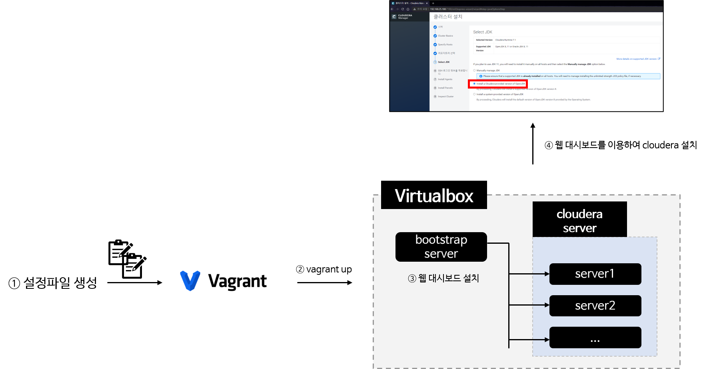
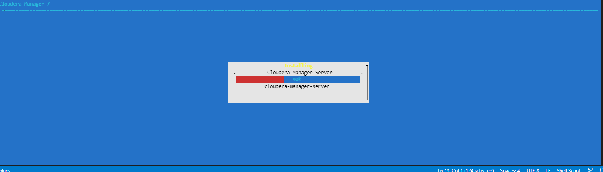
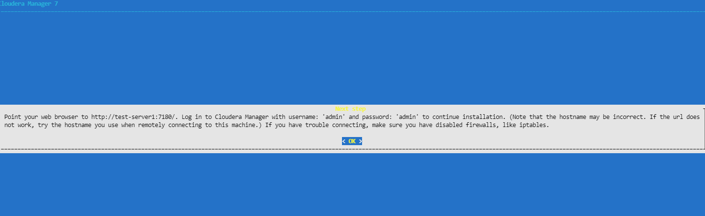
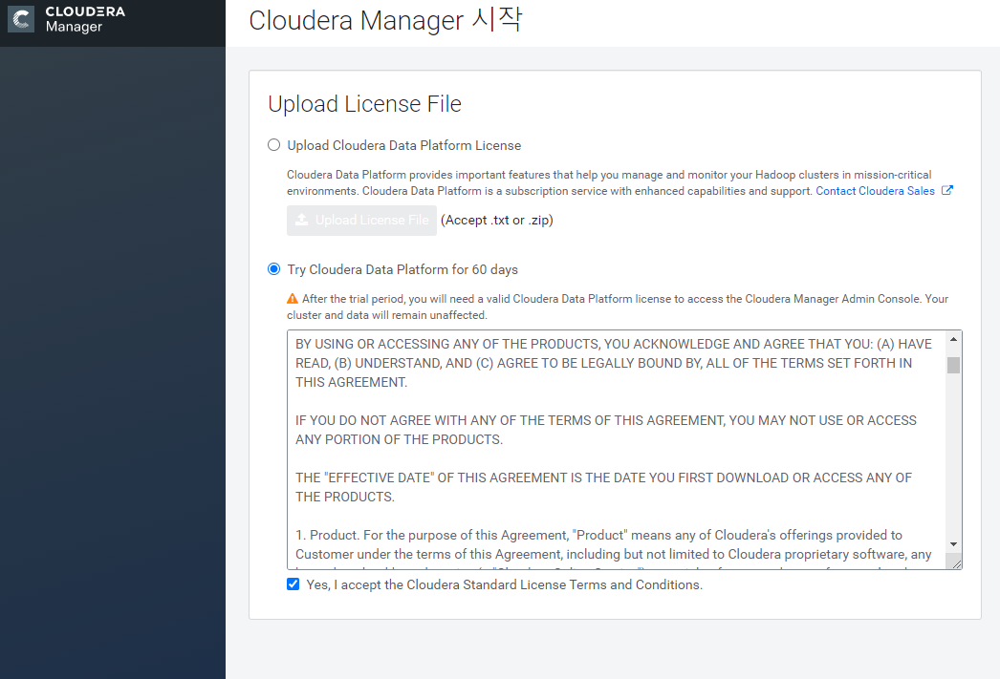

- [1. 개요](#1-개요)
- [2. 준비](#2-준비)
- [3. 설치방법](#3-설치방법)
  - [3.1 설정파일 생성](#31-설정파일-생성)
  - [3.2 vagrant 플러그인 설치](#32-vagrant-플러그인-설치)
  - [3.3 vagrant 실행](#33-vagrant-실행)
  - [3.4 웹 대시보드 설치](#34-웹-대시보드-설치)

# 1. 개요
* 클라우데라 60일 평가판 설치를 위한 인프라 구성
* vagrant로 인프라를 구성하고 클라우데라 공식 설치파일을 이용하여 클라우데라 설치



<br>

# 2. 준비
* virtualbox 설치
* vagrant 설치
* python 3.6이상 설치
* 충분한 CPU, 메모리, 디스크 용량
  * 권장 CPU: 4core 이상
  * 권장 메모리: 64GB 이상
  * 권장 디스크 용량: 200GB이상

<br>

# 3. 설치방법
## 3.1 설정파일 생성
* [설정파일 생성 메뉴얼링크](config/Readme.md)파일을 참고하여 설정파일 생성
* 2개의 설정파일이 생성
  * config.yml: vagrant 설정파일
  * hosts: vagrant로 생성된 virtualbox의 hosts파일

## 3.2 vagrant 플러그인 설치
```sh
vagrant plugin install vagrant-disksize
```

## 3.3 vagrant 실행
```
vagrant up
```

## 3.4 웹 대시보드 설치
* putty같은 ssh client로 bootstrap 원격 접속
* sudo ./cloudera-manager-installer.bin
* 설치는 CUI로 진행


* 설치가 끝나면 웹 대시보드 접속(예: http://192.168.25.188:7180)


* 라이센스가 없으므로 평가판 선택

